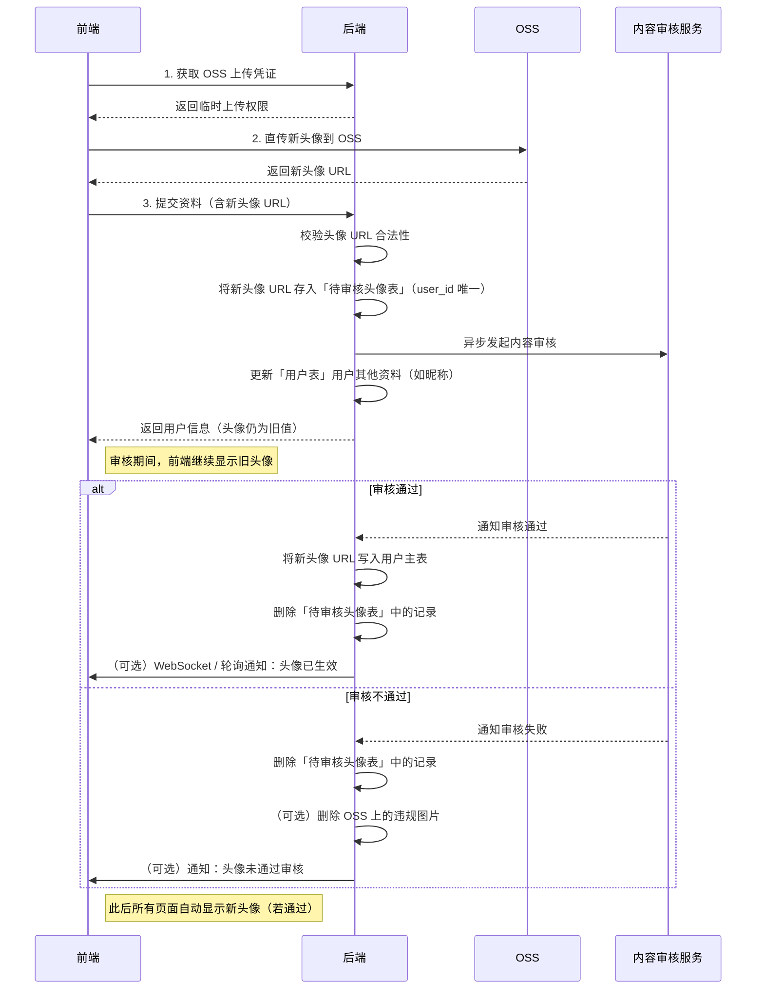

## 个人信息展示

### 需求分析

- 当用户登录成功后，页面右上角的登录按钮变为用户头像
- 用户点击页面左侧导航栏，跳转到个人主页，展示的信息包括：头像、昵称、账号、关注数、粉丝数、获赞数、个性签名

### 涉及接口

- 获取用户信息 - `GET /api/user/profile`

## 修改个人资料

### 需求分析
- 用户可自由修改的信息包括：头像、昵称、账号、个性签名
- 账号不能重复，数据库查重时忽略大小写
- 头像和个性签名理论上需要进行审核，审核通过后才算修改成功

### 前后端交互流程
采用两步接口的方案，先传头像获取 URL，再提交资料：
1. 前端先调用「头像上传接口」，将头像文件传给后端，后端上传到 OSS 后返回新的 URL。
2. 前端拿到 URL 后，和其他用户资料（昵称、个性签名等）一起调用「资料更新接口」，后端更新数据库。

> 进阶方案：前端直传 OSS，减轻后端服务器压力

### 涉及接口

- 用户头像上传 - `POST /api/user/profile/avatar`
- 用户资料更新 - `POST /api/user/profile`

### 前端直传 OSS + 异步审核流程

